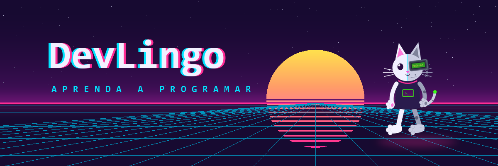
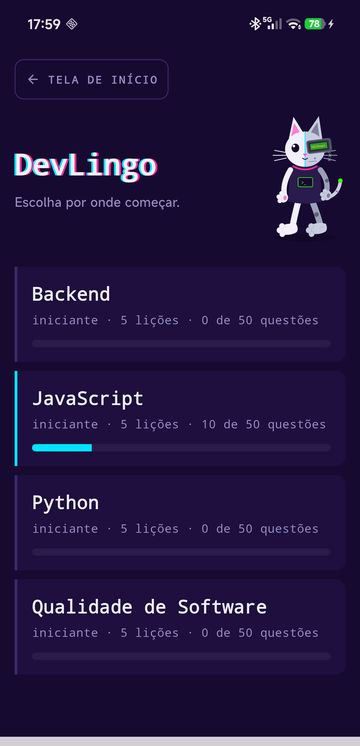
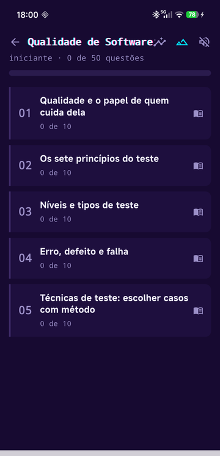
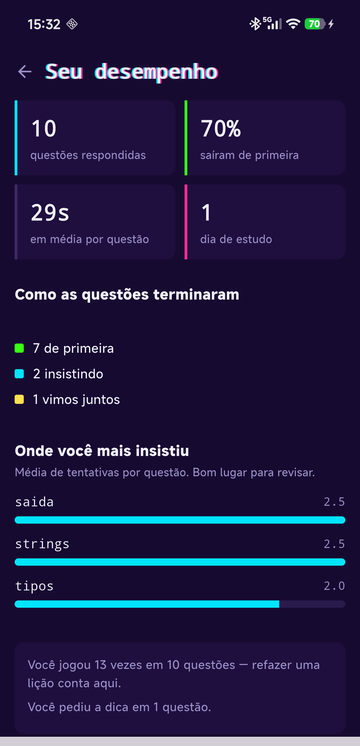

<div align="center">



**Aprenda a programar no formato Duolingo — em português, do zero.**

[](https://github.com/gustavoanderson/DevLingo/releases/latest)

[](https://flutter.dev)
[](https://dart.dev)
[](tools/)
[](https://firebase.google.com)
[](https://sqlite.org)

[](#qualidade-não-é-seção-do-fim)
[](#as-trilhas)
[](#as-trilhas)

</div>

---

## O que é

Um aplicativo Android que ensina programação e engenharia de software em **lições curtas**, no formato que o Duolingo popularizou: você escolhe uma trilha, responde questões, e o progresso fica salvo a cada resposta.

**Feito para o público brasileiro.** Todo o conteúdo é escrito em português — enunciados, aulas, dicas e explicações. Não é tradução: as questões foram pensadas em português, e até detalhes como *não exigir acento no que o aluno digita* existem porque digitar `ç` em teclado de celular é toque longo, e ninguém deveria errar uma questão de programação por causa do teclado.

O guia é o **Tr∅nikAt**, um gato branco ciberneticamente modificado com visor no estilo scouter.

<div align="center">



</div>

---

## O princípio: errar não termina a questão

Esta é a decisão que organiza o app inteiro.

Numa múltipla escolha, a alternativa errada é **riscada, não apagada** — ver o que já foi descartado faz parte do raciocínio por exclusão. Nas questões de escrever, a dica se abre sozinha antes de a resposta ser revelada.

O título nunca diz `ERRADO`. Diz **`AINDA NÃO`**, e ao revelar a resposta diz **`VAMOS JUNTOS`**.

As estatísticas seguem a mesma regra: nada de *"você está pior que ontem"*. O tempo é medido para a pessoa se conhecer, nunca como meta a bater — é o único cartão da tela sem cor de destaque, de propósito.

---

## As trilhas

Quatro trilhas de nível iniciante, **50 questões cada**:

| Trilha | O que cobre |
|---|---|
| **Python** | exibir e guardar valores, operadores, condicionais, strings, listas e laços |
| **JavaScript** | console e variáveis, comparação, funções, strings, arrays |
| **Fundamentos de Backend** | cliente e servidor, HTTP, APIs e REST, bancos de dados, autenticação |
| **Qualidade de Software** | o papel do QA, os sete princípios, níveis de teste, técnicas de teste |

Cada lição começa com uma **aula do Tr∅nikAt** que prepara exatamente os tópicos que as questões vão cobrar. Isso não é convenção: o validador do projeto **reprova** quando os dois deixam de bater, nos dois sentidos — tópico cobrado sem aula que o prepare, e aula que prepara algo que nenhuma questão cobra.

---

## Tecnologias

| Camada | Escolha | Por quê |
|---|---|---|
| **App** | Flutter · Dart | Android primeiro, com porta aberta para iOS |
| **Autenticação** | Firebase Auth | Recuperação de senha por e-mail já vem pronta, e escrever isso à mão é onde nascem falhas de segurança |
| **Nuvem** | Cloud Firestore | Sincroniza o histórico entre aparelhos |
| **Local** | SQLite · `sqflite` | Offline-first: grava local, sincroniza depois. Bateria acabando não pode perder progresso |
| **Conteúdo** | JSON versionado no repositório | Funciona offline, custo zero de leitura, revisável em pull request |
| **Validação** | Python · `jsonschema` | Roda em CI sem depender do Flutter instalado |
| **Arte** | SVG gerado por script Python | O cenário e os sons nascem de código, não de arquivos editados à mão |
| **Áudio** | `audioplayers` + WAV sintetizado | Ondas quadradas geradas por script: chiptune combina com um gato ciborgue |

**Nada de biblioteca de UI pronta.** O fundo synthwave, o cenário em parallax e a cena animada do login são `CustomPainter` — grade em fuga é geometria calculada, e coordenadas escritas à mão não se adaptam a tela nenhuma.

---

## Construído com Claude Code, e o método importa mais que a ferramenta

Este repositório é também um registro de **como se trabalha com uma IA sem abrir mão de qualidade**.

O código foi escrito em pareamento com o [Claude Code](https://claude.com/claude-code), com uma divisão clara: **a análise técnica é da IA, a decisão é humana.** Nenhuma mudança de rumo aconteceu sem aprovação, e há decisões registradas em que a recomendação da IA foi recusada com a informação na mesa — como a de tornar a conta obrigatória.

Três coisas fazem esse arranjo funcionar, e todas estão visíveis no repositório:

**Um contrato escrito.** O [`CLAUDE.md`](CLAUDE.md) tem mais de 1.400 linhas de contexto: decisões tomadas, o porquê de cada uma, armadilhas já encontradas, e o que **não** se deve "consertar" porque foi escolha deliberada. Sem isso, cada sessão nova recomeçaria do zero e desfaria o que a anterior decidiu.

**Regras que pegam o que a releitura não pega.** Escrevendo 100 questões de dois cursos, o validador reprovou seis erros — resposta com acento, dica entregando o gabarito, gabarito mal distribuído, e uma **questão duplicada que ninguém tinha percebido**. Nenhum deles apareceria numa revisão a olho.

**Verificação no aparelho de verdade.** Oito vezes neste projeto a suíte ficou verde escondendo um defeito que só apareceu na tela — uma barra colorida que não desenhava, um vão de mil pixels, um título encostado num ícone. A frase que ficou: **verde quer dizer "passou nas checagens que existem"**.

E os achados mais valiosos vieram de alguém **jogando**: uma questão que marcava como errado um código correto, porque o enunciado não tinha como dizer onde a resposta deveria terminar. Nenhuma suíte encontra isso — só o uso.

---

## Qualidade não é seção do fim

O projeto é também portfólio de alguém em transição de carreira para engenharia de qualidade de software. Então a qualidade não é um capítulo à parte — é o método.

**332 testes automatizados**, e a maioria nasceu de um defeito real. Cada correção vira teste, e cada teste é verificado **removendo a correção de propósito** para ver se ele falha. Os números ficam nas mensagens de commit: `Actual: 0.0`, `Actual: 111.0`, `Found 0 widgets`.

**Um validador de conteúdo com regras que só existem porque algo passou.** Ele reprova gabarito concentrado numa letra, alternativa que repete texto, dica que entrega a resposta, aula fora de sincronia com as questões, marcador de formatação desbalanceado, e duas questões que cobram a mesma resposta com outra roupagem.

**Contrato entre implementações.** A função que normaliza respostas escritas existe em Python e em Dart. Duas implementações da mesma regra divergem em silêncio — então há um [arquivo de casos](tools/normalize_cases.json) que os dois lados leem, e o CI reprova se discordarem.

---

## Rodando o projeto

```bash
# banco de questões
pip install jsonschema
python3 tools/validate_questions.py app/assets/content/

# contrato de normalização entre Python e Dart
python3 tools/test_normalize.py

# o app
cd app
flutter analyze && flutter test
flutter build apk --release --split-per-abi
```

O `google-services.json` **não** vai para o repositório. Quem clonar sem ele não fica sem app: a inicialização do Firebase cai em modo de demonstração, com um aviso na tela — porque tela preta com stack trace puniria quem não tem culpa da configuração.

---

## Estado atual

**O que existe:** as quatro trilhas iniciantes, login com conta, sincronização entre aparelhos, estatísticas do jogador, tela de título em formato de fliperama, cenário animado, realce de sintaxe e som opcional.

**O que não existe:** níveis intermediário e avançado, e as demais linguagens previstas — Node, HTML, CSS, SQL, C#, Go, C++, COBOL e Ruby.

E uma limitação assumida: **as trilhas de Backend e Qualidade de Software ainda não foram jogadas por ninguém.** A dificuldade delas é estimativa, não medição — e o projeto tem por princípio não escrever o próximo nível antes de alguém jogar o anterior.

---

<div align="center">

**[Baixar a versão mais recente](https://github.com/gustavoanderson/DevLingo/releases/latest)** · Android 7.0 ou superior

</div>
